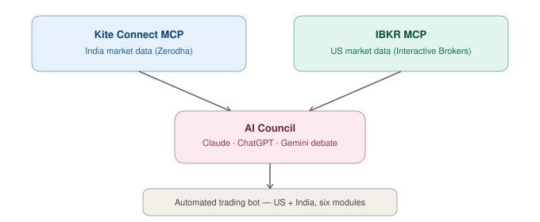

# 📈 Trading Automation Stack

**A multi-broker trading infrastructure spanning US and Indian markets — MCP integrations, a multi-AI decision engine, and an automated trading bot.**

  

---

## 🧭 Overview

A personal infrastructure project connecting AI tooling directly to live brokerage accounts across two markets, built to explore how multi-model AI reasoning holds up against real portfolio decisions rather than backtested theory.

---

## Visual overview

## 🏗️ Components

### Kite Connect MCP Server
A Node.js/TypeScript Model Context Protocol server built for Zerodha portfolio monitoring — giving AI assistants direct, structured read access to a live Indian brokerage account.

### IBKR MCP Integration
A working Interactive Brokers integration exposing account summary, positions, and balance data through the same MCP interface — confirmed operational for real-time account queries.

### Multi-AI Decision Engine — [AI Council](https://github.com/vickybansal99-tech/ai-council)
The "debate" layer of this stack: puts Claude, ChatGPT, and Gemini in structured dialogue over a trading decision before it's made. Built out as its own standalone repo since the framework generalises well beyond trading — see [AI Council](https://github.com/vickybansal99-tech/ai-council) for the full design.

### Automated Trading Bot
A six-module automated trading system spanning both **US markets (via Alpaca)** and **Indian markets (via Kite)** — a single automation layer operating across two entirely different brokerage APIs, asset classes, and market hours.

---

## 💡 Why This Exists

Most "AI trading bot" projects either stop at a backtest or hard-code one model's judgment as ground truth. This stack was built to test something different: whether structured disagreement between multiple frontier models produces better real-money decisions than any single model alone, on live infrastructure rather than a simulator.

---

## 🙋 My Role

Designed and built the full stack — the MCP server integrations, the multi-AI decision framework, and the cross-market automation logic.

---

*Personal infrastructure project. Not investment advice, and not a public trading signal service.*
